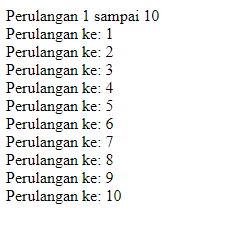
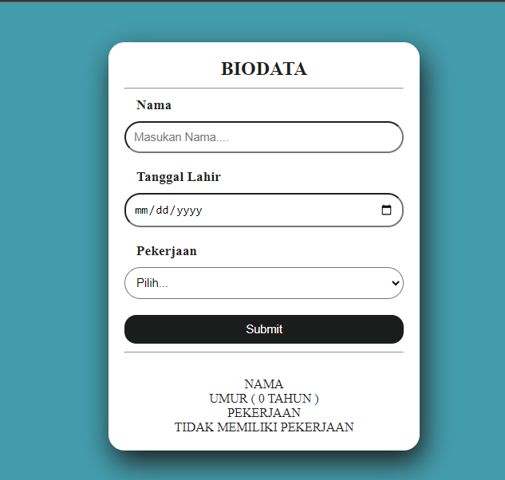
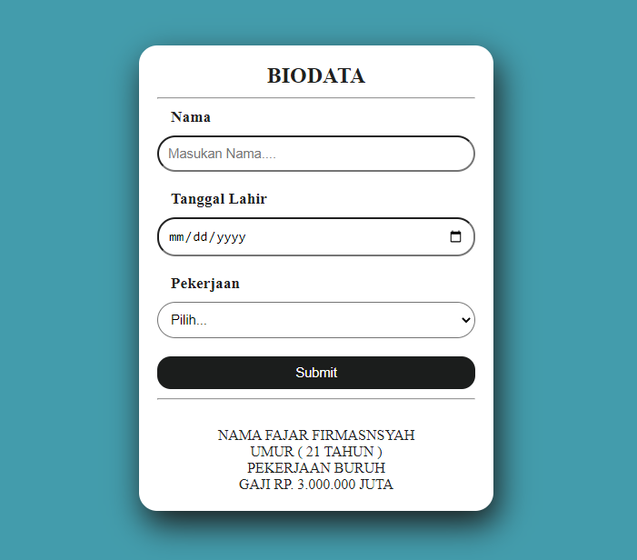
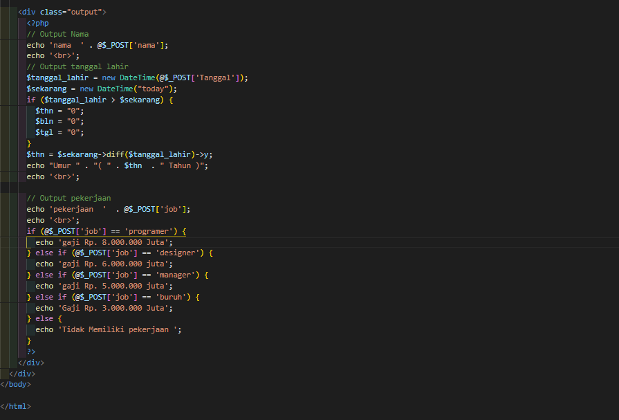
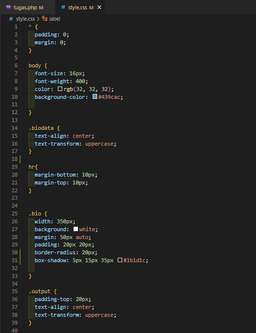

# Lab7Web

## Belajar PHP
1. MEnampilkan Data Diri

2. Membuat Input Nama

3. Membuat perhitungan

4. Looping IF

5. Looping Switch case

6. Looping For

7. Looping while

8. Looping do while

## Tugas
Pertanyaan dan Tugas
Buatlah program PHP sederhana dengan menggunakan form input yang menampilkan nama, tanggal lahir dan pekerjaan. Kemudian tampilkan outputnya dengan menghitung umur berdasarkan inputan tanggal lahir. Dan pilihan pekerjaan dengan gaji yang berbeda-beda sesuai pilihan pekerjaan.

